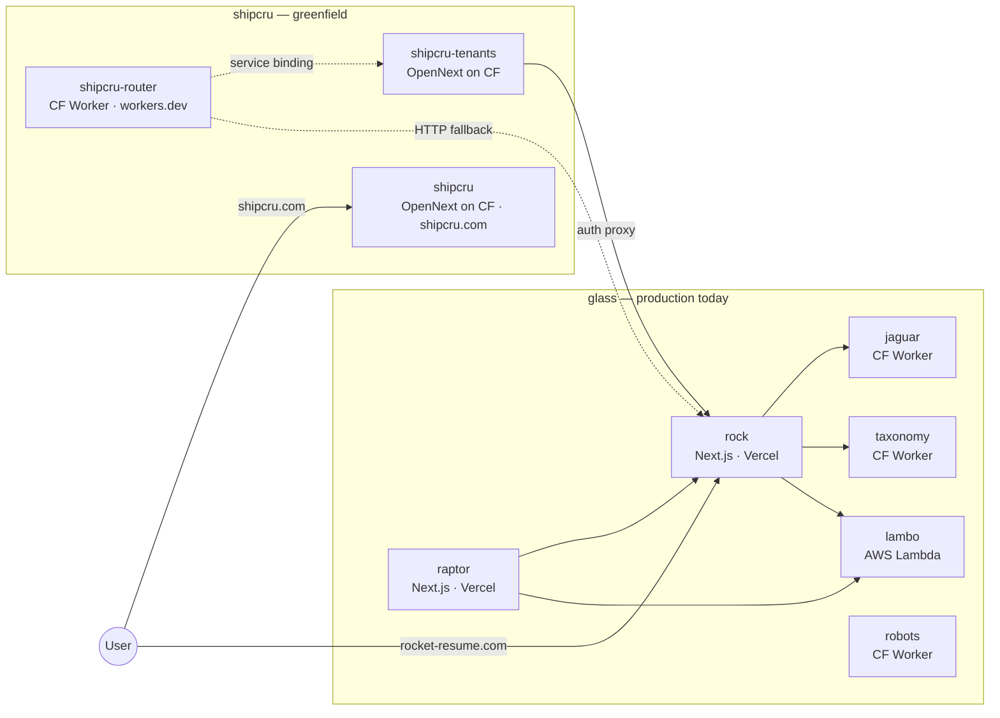
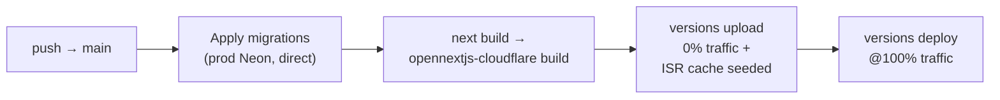
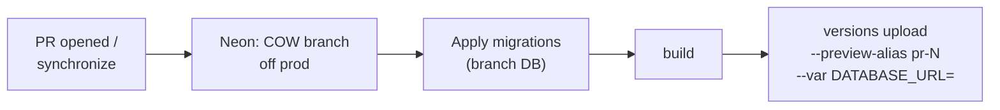

# Architecture

<aside>
💡

The map of what runs where, and where the two repos meet. Read this before changing infra or wiring up new integrations between the apps.

</aside>

# Quick orientation

Two monorepos. Always refer to them by name — never "old" / "new".

| You see…                                                                               | You're in   |
| -------------------------------------------------------------------------------------- | ----------- |
| `package.json` name `glass`, `yarn.lock`, `.yarnrc.yml`, `turbo.json`, `packages/rock` | **glass**   |
| `apps/jaguar`, `apps/taxonomy`, `apps/robots`, `apps/lambo`, `apps/raptor`             | **glass**   |
| `@apollo/server`, `prisma`, `inngest`, `aws-cdk-lib`, `@upstash/redis`                 | **glass**   |
| Workspace packages prefixed `@glass/…`                                                 | **glass**   |
| `package.json` name `shipcru`, `pnpm-workspace.yaml`, `pnpm-lock.yaml`                 | **shipcru** |
| `apps/tenants`, `apps/router-worker`, `apps/web`                                       | **shipcru** |
| `@payloadcms/*`, `@opennextjs/cloudflare`, `drizzle-orm`                               | **shipcru** |
| Workspace packages prefixed `@shipcru/…`                                               | **shipcru** |

`glass` runs production today. `shipcru` is the greenfield replacement, deployed but not yet routing production traffic.

# Topology at a glance

`shipcru-router` is deployed but lives on `shipcru-router.steve-4b7.workers.dev` only — it has no custom domain and is not yet in front of `rocket-resume.com`. Production traffic still hits `glass` directly via Vercel.

# `glass` services

| Service      | Path            | Purpose                                                           | Deploy                                  | Talks to                                                                                            |
| ------------ | --------------- | ----------------------------------------------------------------- | --------------------------------------- | --------------------------------------------------------------------------------------------------- |
| **rock**     | `packages/rock` | Main Rocket Resume app — resume builder, marketing pages, billing | Next.js on Vercel · `rocket-resume.com` | Prisma Data Platform, Redis, S3, Snowflake, Contentful, Stripe, SendGrid, Mixpanel, Sentry, Inngest |
| **raptor**   | `apps/raptor`   | Internal admin (orgs, customers, event testing)                   | Next.js on Vercel                       | rock, lambo                                                                                         |
| **lambo**    | `apps/lambo`    | Event router & async handler orchestration                        | AWS Lambda (CDK)                        | rock, Stripe, Upstash Redis, EventBridge                                                            |
| **jaguar**   | `apps/jaguar`   | PDF / image generation (headless browser)                         | CF Worker (RocketResume CF account)     | R2, CF Images, KV, Durable Objects                                                                  |
| **taxonomy** | `apps/taxonomy` | Content taxonomy GraphQL API (job titles, skills)                 | CF Worker (RocketResume CF account)     | Prisma Data Platform (content schema), KV                                                           |
| **robots**   | `apps/robots`   | Per-environment `robots.txt`                                      | CF Worker (RocketResume CF account)     | —                                                                                                   |

Application data (rock + raptor) sits behind the Prisma Data Platform — the underlying engine is abstracted at the app layer. `raptor` connects to a separate `DATABASE_URL` that is likely CockroachDB based on context. BetterAuth migration in progress on the `glass` side; target engine not yet confirmed in writing.

# `shipcru` services

| Service             | Path                 | Purpose                                                                                                            | Deploy                                                 | Talks to                                                                                                                              |
| ------------------- | -------------------- | ------------------------------------------------------------------------------------------------------------------ | ------------------------------------------------------ | ------------------------------------------------------------------------------------------------------------------------------------- |
| **shipcru-router**  | `apps/router-worker` | Path-based traffic split: matched paths → `shipcru-tenants`; everything else proxied to Vercel `rocket-resume.com` | CF Worker (ShipCru CF account, **no custom domain**)   | KV (`ROUTING_KV`), `shipcru-tenants` (service binding), `glass` rock (HTTP fallback)                                                  |
| **shipcru-tenants** | `apps/tenants`       | Multi-tenant Payload CMS + Next.js app — tenant pages, resume rendering, search                                    | Next.js 15 → OpenNext → CF Worker (ShipCru CF account) | Hyperdrive → Neon (`shipcru-tenants` project), R2, D1 (tag cache), KV (embed cache), Workers AI, OpenAI, `glass` GraphQL (auth proxy) |
| **shipcru**         | `apps/web`           | Marketing site for `shipcru.com`                                                                                   | Next.js 15 → OpenNext → CF Worker (ShipCru CF account) | —                                                                                                                                     |

Production CMS data lives in the ShipCru-org Neon project `shipcru-tenants`, reached through a Cloudflare Hyperdrive config of the same name. There is no direct connection from `shipcru-tenants` to any `glass`-side database.

# Where they meet

| From → To                                                  | Mechanism                     | What flows                                                                                                                                             | Status                                                                                  |
| ---------------------------------------------------------- | ----------------------------- | ------------------------------------------------------------------------------------------------------------------------------------------------------ | --------------------------------------------------------------------------------------- |
| `shipcru-router` → `glass` rock (Vercel)                   | HTTP `fetch()` proxy fallback | All traffic not matched by `ROUTING_KV`. Staging origin: `rock-git-master.rocket-resume.dev`. Production origin: `rock-git-release.rocket-resume.dev`. | Built. Router not yet on `rocket-resume.com`, so this path isn't carrying real traffic. |
| `shipcru-tenants` `/api/auth/proxy` → `glass` rock GraphQL | HTTPS POST                    | Login / signup / password-reset mutations forwarded to `glass`'s existing endpoints                                                                    | Active in code; gates the Phase 0 auth approach.                                        |
| Resume PDFs / images on `rocket-resume.com`                | (no hand-off written)         | Continues to be served by `glass` `jaguar`                                                                                                             | Unchanged. `shipcru-tenants` has no PDF path.                                           |
| `shipcru-tenants` `COCKROACH_HYPERDRIVE`                   | (commented out)               | Planned BetterAuth bridge to `glass` user DB                                                                                                           | Not wired.                                                                              |

No shared CF account, no shared Neon project, no shared cookies, no shared bindings. Integration is HTTP-only.

# Cloud accounts & data homes

## **Cloudflare**

**ShipCru** · `4b75627097c57c8449db718e749395eb`

- Workers — `shipcru-router`, `shipcru-tenants`, `shipcru`
- R2 — `shipcru-tenants-media`, `shipcru-tenants-cache`
- KV — `ROUTING_KV`, `EMBED_CACHE`
- D1 — `shipcru-tenants-tag-cache`
- Hyperdrive — `shipcru-tenants-neon`
- Zone — `shipcru.com`

**RocketResume** · `b728f3d61e915be9eb96d1e0747303e2`

- Workers — `jaguar`, `taxonomy`, `robots`, `google-fonts`
- R2 — jaguar buckets (per environment)
- KV — taxonomy + jaguar namespaces
- Zones — `rocket-resume.com`, `rocket-resume.dev`

## **Neon**

**Ship Cru** · `org-falling-scene-68772201`

- Project `shipcru-tenants` (`aged-wave-42505181`, `aws-us-east-1`) — production CMS DB. Live.

**Steve Zimmerman** · `org-gentle-truth-48208104`

- Project `Taxonomy` (PG 16, `aws-us-east-1`, ~7.7 GB) — legacy Neon used by the old XML sitemap and page-generation paths. Targeted for shutdown once the new stack fully covers its surface.

# Legacy data sources

The old stack reads from more than one DB. Four sources overlap to varying degrees — mapping the diff is the open spike in the Roadmap.

- **Old Taxonomy Neon** (~7.7 GB, PG 16) — V1+V2 job titles, industries, content; powers the old XML sitemap + page generation.
- **ROC RDS-MySQL** — legacy content strings (~20-30M) tied to job-title prompts. Some phrases legally restricted by a competitor lawsuit. Powered the old Rocket Resume app.
- **CRDB taxonomy (CockroachDB)** — new multi-region home on the legacy stack post 2026-04-27 migration. Region-aware via `crdbRegion` columns.
- **ShipCru Neon** (`shipcru-tenants`, ~2.5 GB) — the new CMS DB on the greenfield stack.

Overlap between the first three is the reason for the data sources inventory spike. Once we know what's unique to each, the ROC and old-Taxonomy-Neon shutdowns can sequence.

# CI/CD

<aside>
🚀

GitHub Actions own the deploy pipeline. Production goes blue-green via Cloudflare Workers Versions; every PR gets its own Neon branch + preview Worker version. Read this before touching migrations, secrets, or re-enabling Workers Builds in the Cloudflare dashboard.

</aside>

## Workflows

All three live in `.github/workflows/` and are path-filtered to `apps/tenants/**` so unrelated edits don't trigger deploys.

| Workflow                  | Trigger                               | What it does                                                                                                                                                  |
| ------------------------- | ------------------------------------- | ------------------------------------------------------------------------------------------------------------------------------------------------------------- |
| **production-deploy.yml** | `push` to `main`                      | Migrate prod DB → build → upload new Worker version at 0% traffic → promote to 100%.                                                                          |
| **preview-pr.yml**        | `pull_request` (opened / synchronize) | Create a copy-on-write Neon branch off prod → migrate it → build → upload Worker version with a `pr-N` preview alias bound to the branch's connection string. |
| **preview-cleanup.yml**   | `pull_request` (closed)               | Delete the per-PR Neon branch. The Worker version + alias linger — Cloudflare Workers versions are append-only (see below).                                   |

## Production deploy flow

Step order is load-bearing — see "Build-time DB query gotcha" below.

1. **Migrate** — `pnpm exec payload migrate` against `PRODUCTION_DATABASE_URL` (direct Neon, not Hyperdrive).
2. **Build** — `pnpm exec opennextjs-cloudflare build`. `DATABASE_URL` is set so `payload.config.ts` short-circuits Hyperdrive and connects directly to Neon. No `wrangler login` needed at build time.
3. **Upload** — `pnpm exec opennextjs-cloudflare upload` boots the Worker under Miniflare to seed the ISR cache. Miniflare requires `CLOUDFLARE_HYPERDRIVE_LOCAL_CONNECTION_STRING_HYPERDRIVE` set to the prod DB URL. New version is appended at **0% traffic** — the existing version keeps serving 100%.
4. **Promote** — `wrangler versions deploy <id>@100% --yes` flips traffic. This is the blue-green boundary.

If the upload step fails, the existing version keeps serving traffic. If migrate fails, nothing else runs.

## Per-PR preview flow

Each PR gets a copy-on-write Neon branch via `neondatabase/create-branch-action@v5` (instant, charged only for divergence). The Worker version is uploaded with a `pr-N` preview alias and the branch's connection string baked in as a `--var DATABASE_URL` override. Preview URL pattern: `pr-N-shipcru-tenants.steve-4b7.workers.dev`.

On PR close, `preview-cleanup.yml` deletes the Neon branch via `neondatabase/delete-branch-action@v3`. The Worker version and its preview alias **stay** — Cloudflare Workers Versions are append-only and there is no `wrangler versions delete-alias` command. CF garbage-collects unused versions after ~30 days. Hitting a stale preview URL after cleanup will load the Worker but fail at the DB layer because the branch is gone.

## Build-time DB query gotcha

`next build` calls `generateStaticParams` for the tenant routes, which queries Tenants/Pages via Payload. Payload + Drizzle **always** join every related sub-table on a parent query — `select` does not opt out. So if a fresh migration adds a sub-table (e.g. `tenants_seo_organization_same_as`) and the build runs **before** the migration is applied, the build crashes with `relation "..." does not exist`.

**Rule:** migrate before build. Both `production-deploy.yml` and `preview-pr.yml` enforce this ordering.

## Migration convention

The build-time join means a single PR can only ship **expand-safe** schema changes — additive only. New tables, new columns (nullable or with defaults), new sub-tables. No drops. No `NOT NULL` on populated tables without a default.

Destructive changes split across two PRs:

1. **PR 1 (expand)** — add the new column/table. Code reads from both old and new. Land and deploy.
2. **PR 2 (contract)** — drop the old column/table. Land and deploy.

Each PR is individually expand-safe, so each one's `migrate → build → upload` sequence runs cleanly against the live prod schema.

Validated end-to-end on PR #18 (expand: add `internal_note` column) and PR #19 (contract: drop it) on 2026-04-30.

## DATABASE_URL precedence

`payload.config.ts` resolves the Postgres connection string in this order:

1. `cloudflare.env.DATABASE_URL` — set explicitly during preview (per-PR Neon branch URL via `--var`).
2. `process.env.DATABASE_URL` — set during prod build/migrate (direct Neon).
3. `cloudflare.env.HYPERDRIVE.connectionString` — runtime default (Hyperdrive proxy in front of prod Neon).

Build and migrate steps bypass Hyperdrive because Hyperdrive is a runtime-only proxy that needs the Workers runtime to resolve. Production traffic at runtime always goes through Hyperdrive (connection pooling, edge caching).

## Secrets & variables

GitHub repo secrets (Settings → Secrets and variables → Actions):

| Name                      | Used by                       | What it is                                                                                          |
| ------------------------- | ----------------------------- | --------------------------------------------------------------------------------------------------- |
| `PRODUCTION_DATABASE_URL` | production-deploy             | Direct Neon connection string (not Hyperdrive). Used for migrate, build, and Miniflare ISR seeding. |
| `PAYLOAD_SECRET`          | production-deploy, preview-pr | Payload signing secret. Same value across envs.                                                     |
| `CLOUDFLARE_API_TOKEN`    | production-deploy, preview-pr | Workers + Hyperdrive deploy permissions on the ShipCru CF account.                                  |
| `CLOUDFLARE_ACCOUNT_ID`   | production-deploy, preview-pr | `4b75627097c57c8449db718e749395eb` (ShipCru).                                                       |
| `NEON_API_KEY`            | preview-pr, preview-cleanup   | Org-level Neon API key for branch create/delete.                                                    |
| `NEON_PROJECT_ID`         | preview-pr, preview-cleanup   | `aged-wave-42505181` (`shipcru-tenants`).                                                           |

## Cloudflare Workers Builds — disconnected

The Cloudflare dashboard has a "Workers Builds" feature that auto-builds on git push. It was previously connected to `ShipCru/shipcru` and ran in parallel with `production-deploy.yml`, deploying twice on every merge to `main`. **Disconnected** in the Worker → Settings → Build panel.

All deploys now go through GitHub Actions only. If anyone re-enables Workers Builds: it does a single-version flip (no upload-at-0%, no separate promote step), and it will race with `production-deploy.yml`. Leave it off.
