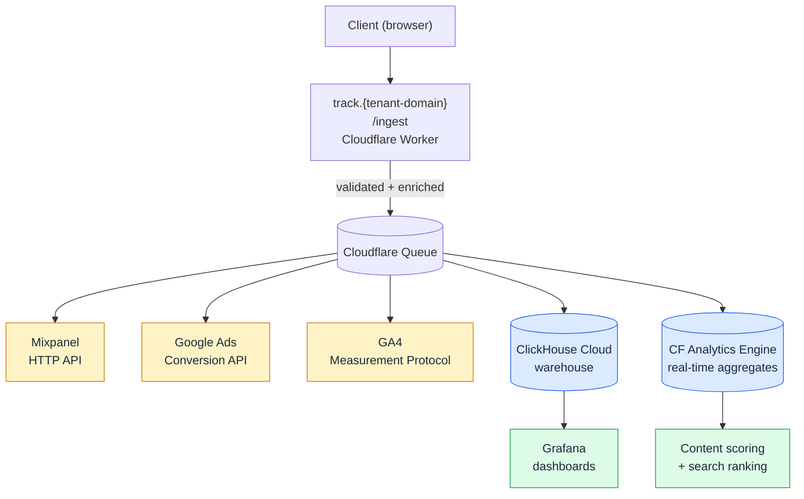
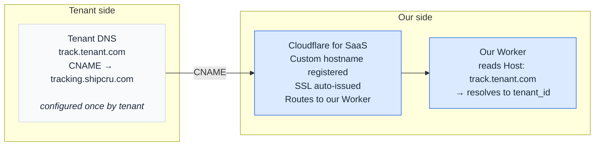

# Analytics & Tracking

Status: Review
Summary: Updated proposal: integration model (Replace/Bridge/Boundary), canonical event schema, multi-tenant ingest via CF for SaaS, ClickHouse + CF Analytics Engine + Grafana, A/B testing integration with existing Glass assignments system.

# TOC

# 1. Context

Some existing functionality stays in place and is read by the new pipeline rather than rebuilt — most notably the A/B assignments system and Stripe customer metadata. Those integration points are noted in the relevant sections below.

**Out of scope:**

- Heatmaps and session replay — deferred. If needed later, vendor SDKs can be re-attached client-side per-page.
- Inngest — this pipeline has no intersections with it.

## Performance baseline (verified on prod)

Measured on `rocket-resume.com` homepage:

- Total JS transferred: **2.63 MB** across 113 scripts
- Mixpanel chunk: **112 KB (4.3% of JS)**, already async-loaded via `requestIdleCallback`, not render-blocking
- Real bundle hog: `_app-*.js` at **843 KB (32%)** — GraphQL ops, auth, util bundled into every page entry
- FCP 1156ms, Load 3590ms

"Mixpanel = 90% of bundle" isn't what we see in prod. Perf impact from Mixpanel today is moderate — mostly main-thread parse + session replay CPU, not load time. The existing `requestIdleCallback` deferral works.

Six vendor domains fire directly from the client today: Mixpanel, googletagmanager, googleadservices, doubleclick, [analytics.google](http://analytics.google), Sentry. Each has its own SDK, DNS handshake, ad-blocker exposure, and schema. Consolidating behind one first-party endpoint gives us:

- Fewer ad-blockers — first-party domains are rarely blocked
- Unified schema across all destinations
- Vendor swap without client changes
- Central PII / auth filtering
- Better performance — fewer scripts on the page, less main-thread work

# 2. Architecture

## Target architecture

Key properties:

- **First-party domain per tenant** — bypasses most ad blockers; `track.{tenant-domain}` resolves to our Worker via CF for SaaS Custom Hostnames.
- **Tiny client SDK** (~2-5 KB wrapper) — no vendor lib on critical path.
- **Tenant identity from Host header** — no hardcoded domain in the Worker; tenant resolution looks up by Host.
- **Hashed identifiers past the Worker boundary** — raw email/phone never touches the warehouse or destination outputs.
- **Assignment dimensions on every event** — variant data flows alongside the event, not just to Stripe.
- **Central schema, swappable destinations** — destination changes don't require client changes.

## Canonical event schema

Every event flowing through the ingest endpoint carries a fixed dimensional skeleton plus an event-specific payload. This skeleton is non-negotiable from day one — adding dimensions retroactively to a warehouse with months of historical data is painful and often produces queries that quietly break on older rows.

| Field | Type | Purpose | Source |
| --- | --- | --- | --- |
| `event_name` | string | Discriminator | Client / server emitter |
| `event_id` | uuid | Idempotency, dedup | Client-generated |
| `timestamp` | iso8601 | When the event occurred (client time) | Client |
| `ingested_at` | iso8601 | When the Worker received it | Worker |
| `tenant_id` | string | Multi-tenancy partition | Worker (from Host header) |
| `user_id` | string | null | Authenticated user identifier | Session / cookie |
| `device_id` | string | Anonymous identifier; persists across sessions | Cookie |
| `session_id` | string | Session correlation | Cookie |
| `assignment_id` | string | A/B bucketing seed (= oldest device_id today) | Cookie / DB |
| `experiments` | map&lt;string, string&gt; | Active experiment → variant assignments | Read from assignments system |
| `gclid` / `gbraid` / `wbraid` | string | null | Google Ads click identifiers | URL params on landing, persisted to cookie |
| `utm_*` | strings | Source attribution | URL params on landing |
| `identifiers_hashed` | object | null | SHA-256 of email, phone for enhanced conversions | Worker-side hashing of server-known values |
| `url` / `referrer` / `user_agent` | strings | Standard context | Client |
| `payload` | object | Event-specific properties | Emitter |

**Why each non-obvious field exists**:

- `tenant_id` is collected at the ingest boundary today but dropped before reaching destinations. Closing this gap is essentially free if we require it from the start.
- `experiments` map closes the gap surfaced earlier: today, variant data lives only in Stripe metadata; the warehouse can't answer questions like "did variant X convert better than variant Y?" without joins to Stripe data. Carrying assignments inline solves this.
- `assignment_id` mirrors the existing concept (oldest device_id) so JOINs against any data still flowing through Stripe metadata stay possible.
- `identifiers_hashed` enables enhanced conversions (see *Enhanced conversions* below) without touching raw PII outside the Worker.

## Multi-tenant ingest (CNAME)

Every endpoint — web, API, analytics — must be reachable on a tenant's domain via a single CNAME configuration. For the analytics ingest specifically, this means `track.{tenant-domain}` resolves to our Worker.

### Approach

The ingest endpoint is served via [**Cloudflare for SaaS](https://developers.cloudflare.com/cloudflare-for-platforms/cloudflare-for-saas/) Custom Hostnames**. Tenants point a subdomain at our infrastructure with a single CNAME record — e.g. `track.tenant.com` → us. SSL certificates are auto-issued. The Worker reads tenant identity from the Host header on every request, so the same code serves all tenants.

For tenants that can't or won't configure DNS (small partners, free-tier trials), the same pipeline is reachable via a subdomain on our domain (`tenant.shipcru.com`). Same Worker, same code, no first-party benefit. Treated as a fallback, not the default.

Apex domain support (`tenant.com` itself, no subdomain) is gated to Cloudflare Enterprise. Not in scope; revisit only if a tenant contract requires it.

### CF for SaaS pricing

CF for SaaS pricing is independent of zone plan tier — Free, Pro, Business all use the same Custom Hostnames pricing.

| Tenants | Monthly cost | Notes |
| --- | --- | --- |
| 10 (early pilots) | $0 | Within free 100 |
| 100 (initial GA) | $0 | At free cap |
| 500 | $40/mo | 400 × $0.10 |
| 1,000 | $90/mo | 900 × $0.10 |
| 10,000 | $990/mo | 9,900 × $0.10 |

First 100 hostnames included. $0.10/mo each from 101 to 50,000. Above 50k: contact sales (Enterprise).

One-time prerequisite: payment method on file when CF for SaaS is enabled, even at $0/mo.

### What's gated to Enterprise

Features listed below require CF Enterprise (price not public, typically $X,000s/mo). We do not budget for these and only revisit if a specific tenant requirement forces it.

- Apex domain support (`tenant.com` itself, not `x.tenant.com`)
- Wildcard custom hostnames
- Custom certificates / mTLS / BYOIP
- WAF beyond Free-zone tier on customer hostnames

## Data destinations

The pipeline writes to three destinations:

| Layer | Service | Purpose | Cost at projected volume |
| --- | --- | --- | --- |
| Warehouse | **ClickHouse Cloud Basic** | Full SQL, ad-hoc analysis, materialized views | ~$70-100/mo |
| Real-time aggregates | **CF Workers Analytics Engine** | Content-scoring loop + search ranking inputs | $0 (within Workers Paid plan quota) |
| Dashboards | **Grafana Cloud** | Replaces Mixpanel as analyst-facing UI in Phase 3 | $0 (free tier sufficient through Phase 3) |

**Total: ~$70-100/mo** at projected volume (~3M events/mo, ~50 GB storage). Actual volume to be confirmed once tracking is live.

Alternatives considered (Tinybird, BigQuery, PostHog, AWS) are documented in the [previous version of this proposal](Analytics%20&%20Tracking/Analytics%20&%20Tracking%203459e5177cdd80aa8c6af2c41da678ec.md). PostHog was ruled out — cost concerns at our volume + preference for a headless integration where the analytics UI is swappable.

## A/B testing — integration with the assignments system

This is a **boundary**, not a rebuild. The existing `assignments` system stays where it is. Our pipeline reads from it and carries variant data into events.

- **Read assignments at event-emission time** and include them in the `experiments` map of every event.
- **Do not write to Stripe metadata** — that flow stays where it is.
- **Do not reimplement bucketing.** We consume what the existing system produces.
- **Carry `assignment_id` as a top-level dimension** so warehouse JOINs against any Stripe-side data remain possible.

## Identity stitching

**Problem today:** anonymous events stay keyed by anonymous `device_id` forever. When a user signs up, the database connects pre-signup resumes to the new user, but no `alias()` call fires to the analytics layer.

**Fix:** emit an `identity.stitch` event at signup carrying both the prior `device_id` and the new `user_id`.

**Result:**

- Warehouse JOINs associate historical anonymous events with the authenticated user
- Funnel analysis from first landing through purchase becomes possible
- Implementation: one extra event type, Worker-side handling, dedicated `identity_stitches` table in ClickHouse

## Enhanced conversions

**Problem today:** standard Google Ads conversion tracking sends only "this gclid converted." Cookie restrictions, ITP, and ad-blockers cause a chunk of conversions to be lost — the ad click is seen, but the conversion ping never arrives.

**Fix:** enhanced conversions add a second signal — hashed first-party identifiers (email, phone) sent alongside the gclid. Google hashes the same fields on signed-in Google users and matches the two, recovering **5–15% of otherwise-lost conversions**.

Hashing happens in the Worker; raw email/phone never reaches the warehouse or destination outputs.

### Capture points

- **Email**: reliably available at signup. Hash at the signup event and at the purchase event.
- **Phone**: NOT captured at signup. Appears later via the resume builder's contact section or profile updates. Hash whenever it becomes available; treat as opportunistic.

### Click-ID capture

Click ID capture (`gclid`, `gbraid`, `wbraid`) on landing pages is a prerequisite — currently absent in the codebase.

# 3. Execution

## Ads attribution — zero-drop guarantee

Google Ads conversion tracking remains functional throughout the migration:

- **Phase 0+**: fire Google Ads Conversion API server-side with click IDs (gclid, gbraid, wbraid) captured client-side. Zero conversion drop relative to current setup.
- **Phase 1+**: enhanced conversions add hashed user identifiers to recover an additional 5–15% of conversions currently lost to ad-blockers and cookie restrictions.
- **Cutover rollback**: dual-write window (new pipeline + existing direct calls) catches mismatches before the old path is removed.

## Phases

### Phase 0 — Cloudflare infra verification (About, Legal, Support)

Goal: prove the new CF + Payload + OpenNext stack on low-traffic, low-risk pages. **No analytics rework.**

- Ship About / Legal / Support on new stack
- Port existing client-side analytics setup as-is to the new pages: Mixpanel (lazy + `requestIdleCallback`), GTM, GA4, Google Ads pixels, Sentry client. Event schema and vendor domains unchanged.
- Shared cookies on `rocket-resume.com` provide session/device/UTM continuity across old ↔ new pages.
- CF Worker reverse proxy routes these URL groups to the new app; everything else stays on Vercel.

Decisions made on analytics in this phase: none. Tracking rebuild starts Phase 1.

### Phase 1 — First-party ingest endpoint

Build the first-party ingest endpoint at `track.rocket-resume.com/ingest`. Endpoint fans out to Mixpanel, Google Ads Conversion API, and ClickHouse. Limited initially to new pages and the minimal event set (page_view, auth, cta_click).

Output: own ingest infra live, warehouse receiving events, vendor dashboards unaffected.

### Phase 2 — Event parity + higher-traffic pages

- Cover all existing event types through ingest endpoint
- Migrate more pages onto new app
- Dual-write: new pages via ingest, old pages still direct, both flow into Mixpanel dashboards
- Decision points: replay/heatmap re-attach (per-page basis, if requested)

### Phase 3 — Full cutover

- All pages on new app
- Remove direct-to-vendor client paths
- **Sunset Mixpanel as primary dashboard UI.** Grafana on ClickHouse becomes the analyst-facing surface.
- **Cutover gate: dashboard parity sign-off.** Before removing Mixpanel access, equivalent Grafana dashboards must exist for current dashboard users.
- Content-scoring loop: ClickHouse materialized views + CF Analytics Engine aggregates feed search ranking.

## ShipCru-side setup

Below are things to be set up before Phase 1 kickoff.

- **ClickHouse Cloud account** — analytics warehouse
    - Create account, provision Basic tier, pick region (region depends on GDPR / data residency answer)
    - Share connection string + service token with FR
- **Cloudflare for SaaS** — enables tenant CNAMEs to reach the analytics endpoint
    - Enable on the `shipcru.com` zone
    - Add payment method (required even though monthly bill stays $0 under 100-hostname cap)
- **Grafana Cloud account** — dashboard layer on top of ClickHouse
    - Create account (free tier sufficient for Phase 3)
- **Google Ads API access** — server-side conversions + enhanced conversions
    - Apply for a Developer Token from Google
    - Generate a Manager refresh token for OAuth

# 4. Open questions

1. **Mixpanel contract / lock-in window** — affects when Phase 3 cutover can happen.
2. **GDPR / data residency** — drives ClickHouse region choice and whether EU-only data isolation is required.
3. **Mixpanel access for FR** — viewer access needed to inventory current dashboards and build Grafana equivalents. Phase 3 cutover gates on parity sign-off from whoever uses Mixpanel today.
4. **Apex domain demand from any pilot tenant** — flag if any tenant requires `customer.com` rather than `x.customer.com`. Forces CF Enterprise upgrade conversation.
5. **Enhanced conversions identifier capture points** — confirm signup and purchase as the two reliable email-capture moments. Phone remains opportunistic.

<aside>
❗

**Updated proposal**
The previous version is preserved as a subpage for reference.

[Analytics & Tracking](Analytics%20&%20Tracking/Analytics%20&%20Tracking%203459e5177cdd80aa8c6af2c41da678ec.md)

</aside>